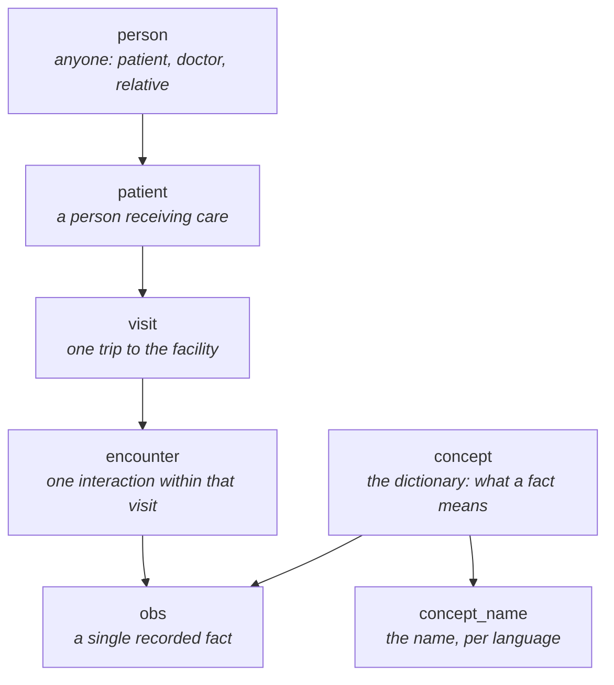

# 🗺️ OpenMRS Core — A Friendly Guide

*A plain-English tour of what this project is, how to run it, and the commands and queries that
tell you what's actually going on inside it.*

New here? Read the first two sections and skip the rest until you need them.

---

## 📖 Table of Contents

1. [What is this project?](#-what-is-this-project)
2. [The one idea that makes everything click](#-the-one-idea-that-makes-everything-click)
3. [How the data fits together](#-how-the-data-fits-together)
4. [What's actually in this repository](#-whats-actually-in-this-repository)
5. [Running it](#-running-it)
6. [Command cheat sheet](#️-command-cheat-sheet)
7. [Queries that give you insight](#-queries-that-give-you-insight)
8. [Exploring the code without running anything](#-exploring-the-code-without-running-anything)
9. [Gotchas worth knowing early](#️-gotchas-worth-knowing-early)
10. [Where to go next](#-where-to-go-next)

---

## 🏥 What is this project?

**OpenMRS is an open-source electronic medical record (EMR) system.** It is used by hospitals and
clinics around the world, with a strong presence in low-resource settings where commercial medical
software is unaffordable or a poor fit.

This repository is **`openmrs-core`** — the *platform* the whole ecosystem is built on. It gives you:

- a **clinical data model** (patients, visits, encounters, observations, drug orders, …)
- a **Java API** for working with that data safely
- a **web application shell** that loads modules and handles login, admin and setup
- a **database migration system** that keeps schemas up to date across versions

Current version in this repo: **3.0.0-SNAPSHOT**.

---

## 💡 The one idea that makes everything click

**OpenMRS Core is a platform, not a finished product.**

If you start it up expecting a polished clinical application, you will be confused — you get a
login page, an admin section, and not much else.

> Think of it like WordPress. `openmrs-core` is *WordPress core*. It gives you users, a database,
> an admin panel and a plugin system. The actual site — the pages a person uses — comes from
> **modules** you install on top.

Real deployments are called **distributions**: core, plus a curated set of modules, plus
configuration. So "OpenMRS is empty" almost always means "you haven't installed a UI module yet."
The classic one is **Legacy UI** — see [`WINDOWS_SETUP_GUIDE.md`](WINDOWS_SETUP_GUIDE.md) for how to
add it.

Two more consequences worth internalising:

- **The REST API is not in this repo.** There are zero REST controllers in core. HTTP endpoints come
  from the separate `webservices.rest` module. Install it before expecting to `curl` anything.
- **Nothing is ever really deleted.** See [Gotchas](#️-gotchas-worth-knowing-early).

---

## 🧩 How the data fits together

Almost every clinical fact in OpenMRS is stored the same way: as a row in the **`obs`**
(observation) table. Blood pressure, a diagnosis, a birth weight, an answer to a form question —
all observations.



Reading that bottom-up: an **obs** says *"for this person, this concept had this value at this
time."* The **concept** is the crucial part — it is the dictionary entry defining what is being
measured, in every supported language.

That is why the concept dictionary matters so much in OpenMRS. **The dictionary is the schema.**
Adding a new kind of measurement usually means adding a concept, not adding a database column.

| Table | Plain English |
|---|---|
| `person` | Anyone the system knows about — patients, staff, relatives |
| `patient` | A person who receives care (shares its id with `person`) |
| `person_name` | Names, split into given / middle / family |
| `visit` | One trip to the facility, with a start and stop time |
| `encounter` | One interaction inside a visit (a consultation, a lab draw) |
| `obs` | One recorded fact. The heart of the system |
| `concept` | The dictionary entry saying what a fact *means* |
| `orders` | Something requested — a drug, a test, a referral |
| `users` | Login accounts (each linked to a `person`) |

---

## 📦 What's actually in this repository

Seven Maven modules, about **1,238 Java files**:

| Folder | What it is for | Start here if… |
|---|---|---|
| `api/` | The core Java API, domain model and Hibernate mappings | …you want to understand the system. **This is the heart.** |
| `web/` | Web-layer Java: filters, servlets, session handling | …you are debugging login or startup |
| `webapp/` | Builds `openmrs.war` — JSPs, images, the app shell | …you are changing the packaged app |
| `liquibase/` | Database migration tooling | …you are changing the schema |
| `tools/` | Build-time helpers (doclets). Not shipped | …rarely |
| `test/` | Shared test infrastructure | …you are writing tests |
| `test-module/` | A tiny example module used by tests | …you want to see what a module looks like |

Some numbers that give you a feel for the scale:

- **135** domain classes in `api/src/main/java/org/openmrs/` (`Patient`, `Obs`, `Concept`, …)
- **21** service interfaces in `api/src/main/java/org/openmrs/api/` — the public API surface
- **116** database tables in the reference schema

The service interfaces are the best map of what the platform can do:

```
AdministrationService    CohortService          ConceptService       ConditionService
DatatypeService          DiagnosisService       EncounterService     FormService
LocationService          MedicationDispenseService                   ObsService
OrderService             OrderSetService        PatientService       PersonService
ProgramWorkflowService   ProviderService        SerializationService StorageService
UserService              VisitService
```

In Java you reach them all through the static `Context`:

```java
Patient patient = Context.getPatientService().getPatient(1);
List<Obs> observations = Context.getObsService().getObservationsByPerson(patient);
```

---

## 🚀 Running it

### The fast path: Docker

This needs only Docker, and uses the `docker-compose.yml` already in the repo. It starts MariaDB
and the application together, with persistent volumes.

```bash
docker compose up
```

Then open **<http://localhost:8080/openmrs>** and log in with **`admin`** / **`Admin123`**.

> ⏳ **The first run is slow — plan for it.** The Docker build compiles the entire project from
> source, and on first boot the app runs every database migration. Ten to twenty minutes is normal.
> Later starts are much faster because the database volume persists.

To skip building locally and pull a prebuilt image instead:

```bash
TAG=nightly docker compose -f docker-compose.yml up
```

### The manual path

Building and running with your own JDK, Maven and MySQL is covered step by step in
[`WINDOWS_SETUP_GUIDE.md`](WINDOWS_SETUP_GUIDE.md), including installing the Legacy UI module so
there is an actual interface to click around in.

You need **JDK 8 or newer**; CI currently tests on Java 11, 17 and 21.

---

## ⌨️ Command cheat sheet

### Building

```bash
mvn clean install
```

That is the full build with all tests — it takes a long time. **Most of the time you do not want it.**

```bash
mvn clean install -DskipTests
```

Compiles and packages without running tests. This is the one to use while iterating.

### Testing just one thing

The single most useful habit in this repo. Instead of a full build, run one test in one module:

```bash
mvn -B -pl api test -Dtest=Log4JCompatibilityTest -Dcheckstyle.skip -Dlicense.skip -Djacoco.skip -Dformatter.skip
```

- `-pl api` — only the `api` module
- `-Dtest=…` — only that test class (wildcards work: `-Dtest=Patient*Test`)
- the `skip` flags — turn off style, licence, coverage and formatting checks you do not need right now

This turns a coffee break into a few seconds.

### Testing a dependency version without editing files

Any version property in `pom.xml` can be overridden on the command line. Handy for checking whether
an upgrade breaks something, without touching the file or rebuilding:

```bash
mvn -B -pl api test -Dtest=Log4JCompatibilityTest -Dlog4jVersion=2.23.1
```

### Docker

```bash
docker compose up
```

```bash
docker compose logs -f api
```

```bash
docker compose down
```

⚠️ To wipe the database and start completely fresh, add `-v`. This **deletes your data volumes** —
it is how you get a clean slate, and how people lose their test data by accident:

```bash
docker compose down -v
```

### Getting a database shell

```bash
docker compose exec db mysql -uopenmrs -popenmrs openmrs
```

---

## 🔍 Queries that give you insight

Run these in the database shell above. They are all read-only.

> 💡 **Always filter on `voided = 0` / `retired = 0`.** OpenMRS never really deletes anything, so
> without this you will be counting records that clinicians have already retracted.

**How much data is in here?**

```sql
SELECT
  (SELECT COUNT(*) FROM patient   WHERE voided = 0)  AS patients,
  (SELECT COUNT(*) FROM visit     WHERE voided = 0)  AS visits,
  (SELECT COUNT(*) FROM encounter WHERE voided = 0)  AS encounters,
  (SELECT COUNT(*) FROM obs       WHERE voided = 0)  AS observations,
  (SELECT COUNT(*) FROM concept   WHERE retired = 0) AS concepts;
```

**What is this system actually used to record?** — the most common observations, by name. This one
question tells you more about a deployment than any amount of reading.

```sql
SELECT cn.name AS concept, COUNT(*) AS times_recorded
FROM obs o
JOIN concept_name cn ON cn.concept_id = o.concept_id
WHERE o.voided = 0
  AND cn.voided = 0
  AND cn.locale = 'en'
  AND cn.locale_preferred = 1
GROUP BY cn.name
ORDER BY times_recorded DESC
LIMIT 20;
```

**Is anyone using it, and when?** — activity per month.

```sql
SELECT DATE_FORMAT(encounter_datetime, '%Y-%m') AS month,
       COUNT(*) AS encounters
FROM encounter
WHERE voided = 0
GROUP BY month
ORDER BY month DESC
LIMIT 12;
```

**What kinds of visits happen here?**

```sql
SELECT vt.name AS visit_type, COUNT(*) AS total
FROM visit v
JOIN visit_type vt ON vt.visit_type_id = v.visit_type_id
WHERE v.voided = 0
GROUP BY vt.name
ORDER BY total DESC;
```

**Who is currently checked in?** — visits that started but never stopped.

```sql
SELECT v.visit_id,
       CONCAT(pn.given_name, ' ', pn.family_name) AS patient,
       v.date_started
FROM visit v
JOIN person_name pn
  ON pn.person_id = v.patient_id
 AND pn.preferred = 1
 AND pn.voided = 0
WHERE v.voided = 0
  AND v.date_stopped IS NULL
ORDER BY v.date_started DESC;
```

**Which encounter types are configured, and are they being used?** — a fast way to spot dead
configuration.

```sql
SELECT et.name,
       COUNT(e.encounter_id) AS used_this_many_times
FROM encounter_type et
LEFT JOIN encounter e
  ON e.encounter_type = et.encounter_type_id
 AND e.voided = 0
WHERE et.retired = 0
GROUP BY et.name
ORDER BY used_this_many_times DESC;
```

**How big is the retracted pile?** — a health check on data quality and training.

```sql
SELECT ROUND(100 * SUM(voided) / COUNT(*), 2) AS percent_voided,
       SUM(voided)                            AS voided_rows,
       COUNT(*)                               AS total_rows
FROM obs;
```

**Patient age distribution.**

```sql
SELECT CASE
         WHEN TIMESTAMPDIFF(YEAR, p.birthdate, CURDATE()) < 5  THEN 'under 5'
         WHEN TIMESTAMPDIFF(YEAR, p.birthdate, CURDATE()) < 15 THEN '5-14'
         WHEN TIMESTAMPDIFF(YEAR, p.birthdate, CURDATE()) < 50 THEN '15-49'
         ELSE '50+'
       END      AS age_band,
       COUNT(*) AS patients
FROM patient pt
JOIN person p ON p.person_id = pt.patient_id
WHERE pt.voided = 0
  AND p.birthdate IS NOT NULL
GROUP BY age_band;
```

---

## 🧭 Exploring the code without running anything

You do not need a database or a build to answer a lot of questions.

**What can the platform do?** — the service interfaces are the API surface:

```bash
ls api/src/main/java/org/openmrs/api/*Service.java
```

**What does the domain model look like?**

```bash
ls api/src/main/java/org/openmrs/*.java
```

**Find where something is implemented** — implementations live in `api/.../api/impl/`:

```bash
grep -rn "class PatientServiceImpl" api/src/main/java
```

**See how a feature is meant to be used.** OpenMRS tests are unusually readable, so they double as
documentation:

```bash
find . -name "PatientServiceTest.java" -not -path "*/target/*"
```

**Find the database migrations:**

```bash
ls api/src/main/resources/liquibase-*.xml
```

`liquibase-schema-only.xml` creates the tables, `liquibase-core-data.xml` loads the starter data,
and `liquibase-update-to-latest.xml` is the upgrade path.

**Check every dependency version in one place** — they are all properties near the bottom of the
root `pom.xml`:

```bash
grep -nE "<[a-zA-Z]+Version>" pom.xml
```

---

## ⚠️ Gotchas worth knowing early

**Nothing is deleted — it is voided or retired.**
Clinical records use a `voided` flag; configuration uses `retired`. Rows stay in the table forever
so the record remains auditable. Forgetting `WHERE voided = 0` is the most common mistake when
querying OpenMRS, and it silently gives you wrong numbers rather than an error.

**An empty-looking system is usually a missing module.**
No patient screens means no UI module installed. That is expected, not broken.

**The first startup is slow, every time you reset the database.**
Migrations plus initial data take minutes. If it looks hung, check `docker compose logs -f api`
before assuming failure.

**`log4jVersion` in `pom.xml` is deliberately pinned.**
It is held at an older release because newer versions break the Log4J 1.x compatibility bridge that
`Log4JCompatibilityTest` guards. The reasoning, the tested version matrix and a seconds-long command
to re-check it are all in the comment above the property. Dependabot is configured to leave it
alone.

**Full builds are almost never what you want.**
Use the single-test command from the cheat sheet. A targeted run finishes in seconds; a full build
does not.

---

## 🔗 Where to go next

| I want to… | Go to |
|---|---|
| Set it up on Windows, with a working UI | [`WINDOWS_SETUP_GUIDE.md`](WINDOWS_SETUP_GUIDE.md) |
| Build and contribute code | [`README.md`](README.md), [`CONTRIBUTING.md`](CONTRIBUTING.md) |
| Report a security issue | [`SECURITY.md`](SECURITY.md) |
| Find an existing module | <https://addons.openmrs.org/> |
| Read the official docs | <https://wiki.openmrs.org/> |
| Ask a human | <https://talk.openmrs.org/> |
| Try it without installing anything | <https://demo.openmrs.org/> |

---

*OpenMRS is released under the Mozilla Public License 2.0 with a Healthcare Disclaimer — see
[`LICENSE`](LICENSE).*
